<!-- markdownlint-disable-next-line MD025 MD022 -->
# Themes
{: .no_toc }

---

<!-- markdownlint-disable-next-line MD022 -->
## Table of Contents
{: .no_toc .text-delta }

1. TOC
{:toc}

---

### Default

This theme will use the theme colors defined for your Visual Studio Code theme.

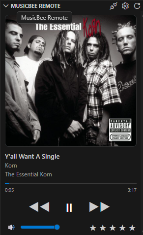
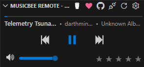

---

### Breeze

Breeze is a dark theme with soft pastel colors and a clean, modern look.

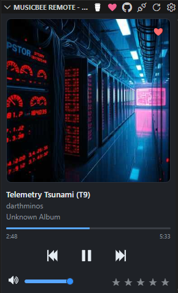
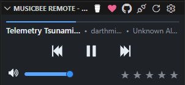

---

### Dracula

Dracula is a dark theme with vibrant colors and a high contrast design, inspired by the popular Dracula color scheme.

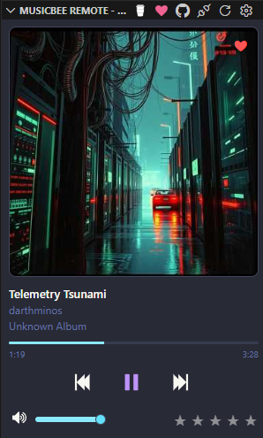
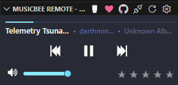

---

### Hotdog

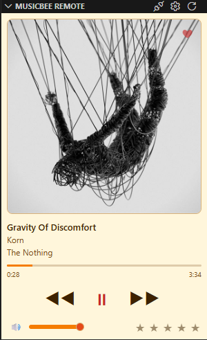
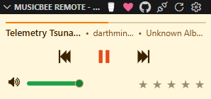

---

### Grayscale

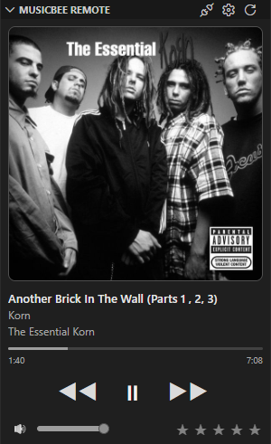
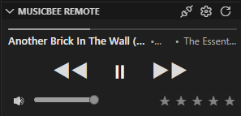

---

### Cyberpunk2077

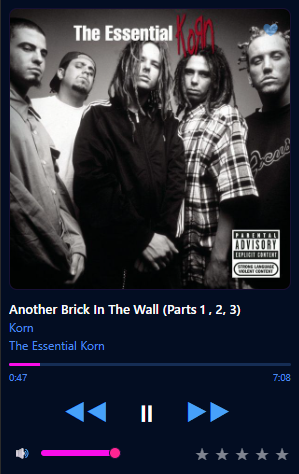
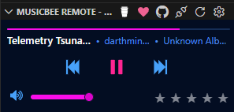

---

### Ubuntu

Ubuntu is a dark terminal-inspired theme based on the classic Ubuntu 16-color palette.

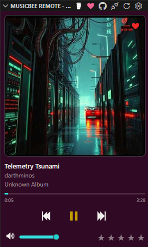
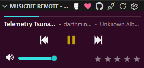

---

### Gogh

Gogh is a dark, high-contrast theme based on a curated terminal palette with cool blues and warm neon accents.

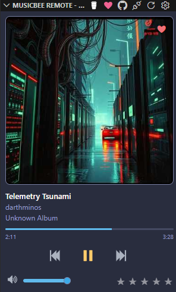
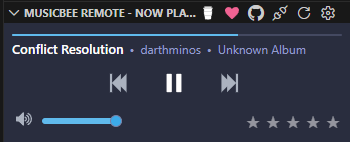

---

### Fairy Floss Dark

Fairy Floss Dark is a soft dark theme inspired by pastel candy colors with a warm, low-contrast base.

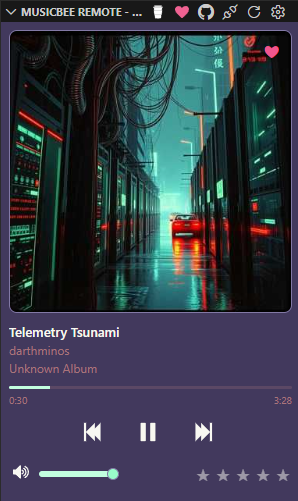
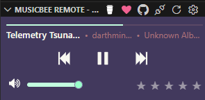

---

### Grass

Grass is a dark green theme built from vibrant grass tones, with bright accents for contrast.

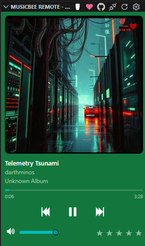
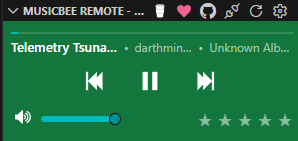

---

### Harper

Harper is a rich, high-contrast dark theme with warm gold and cool blue accents.

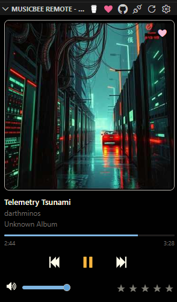
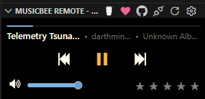

---

### Horizon Bright

Horizon Bright is a light, soft theme with bold accents and a pastel-friendly palette.

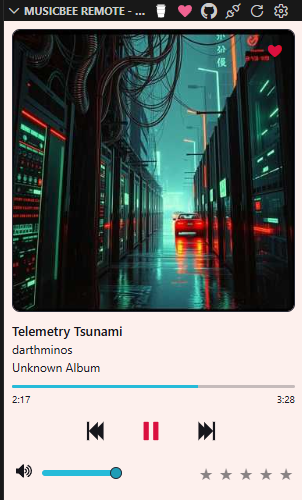
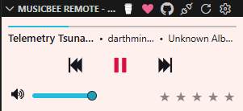

---

### Horizon Dark

Horizon Dark is a moody, dark counterpart to Horizon Bright with neon accents and rich contrast.

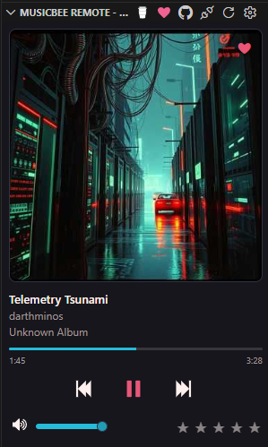
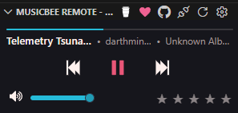

---

### Material

Material is a deep, oceanic theme built around a classic material design palette.

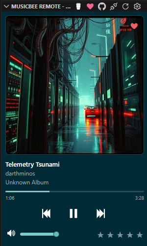
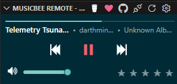

---

### Mono (Amber)

Mono (Amber) is a dark, monochromatic theme with warm amber accents for a cozy, focused vibe.

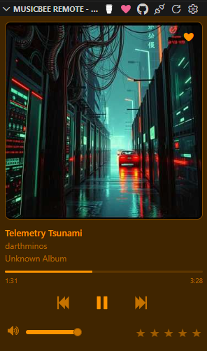
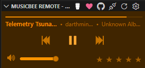

---

### Mono (Cyan)

Mono (Cyan) is a dark, monochromatic theme with cool cyan accents for a calm, focused vibe.

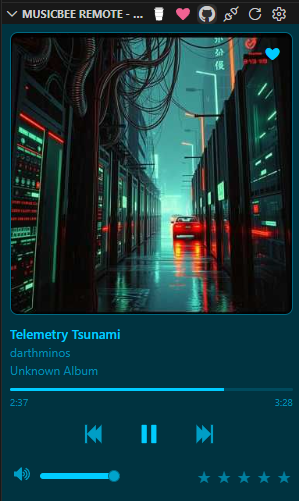

---

### Mono (White)

Mono (White) is a dark, monochromatic theme with soft white accents for a clean, airy vibe.

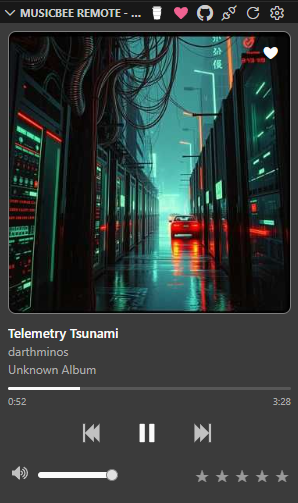
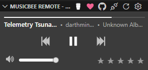

---

### Mono (Yellow)

Mono (Yellow) is a dark, monochromatic theme with bright yellow accents for an energetic, focused vibe.

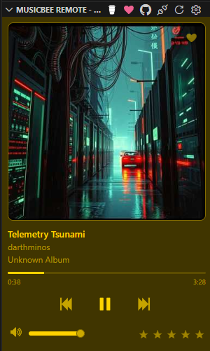
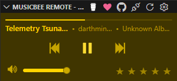

---

### Mono (Red)

Mono (Red) is a dark, monochromatic theme with vibrant red accents for a bold, focused vibe.

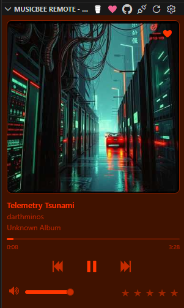
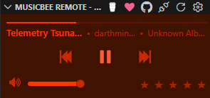

---

### Mono (Green)

Mono (Green) is a dark, monochromatic theme with bright green accents for a fresh, focused vibe.

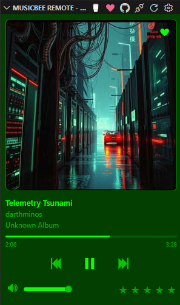
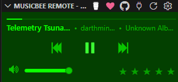
